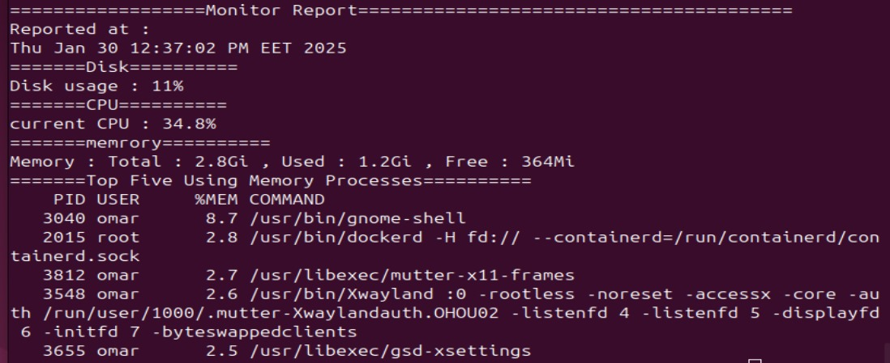
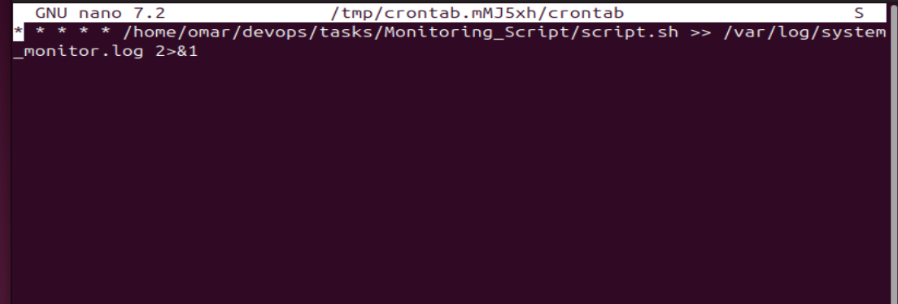

# Monitoring Script

## Description
It is a script to monitor memory, disk, and CPU usage by providing a final report about these resources. The script sends a warning email if disk usage exceeds 80%. It is recommended to run the script in a cron job for continuous monitoring.

## Prerequisites
Before running the script, ensure you have the following tools installed:

- `df` (to check disk usage)
- `top` (to monitor CPU usage)
- `free` (to get memory usage)
- `ps` (to list processes)
- `mail` & `postfix` (to send email notifications)

## Usage

### 1. Clone the repo to your system
```bash
git clone https://github.com/yourusername/system-monitor.git
```
### 2. make the script excutable
```bash
chmod +x monitor_system.sh
```
### 3. run the script 
```bash
sh monitor_system.sh
```
### 4. email configration 
Make sure that the `mail` utility is configured and working correctly to send the warning email. You may need to set up an SMTP server if not already configured.
-visit this link : https://www.youtube.com/watch?v=uNss377DK88

## Script Overview
### 1.monitor_CPU_usage
- Monitors the disk usage of the root directory (`/`).
- Functionality:
  - Captures the percentage of disk space used using the `df` command.
  - Sends an email if the disk usage exceeds 80%.
  - Prints the current disk usage.
### 2.monitor_CPU_usage
 - Monitors the CPU usage.
 - Functionality:
    -Uses top to get the CPU usage, excluding idle time.
    -Prints the current CPU usage.
### 3.monitor_Mem_usage
  - Monitors memory usage.
  - Functionality:
    - Uses free to display the total, used, and free memory in a human-readable format.
    - Prints the current memory usage.
### 4.monitor_top_five
  - Lists the top 5 processes using the most memory.
  - Functionality:
    - Uses the ps command to list processes sorted by memory usage.
    - Prints the top 5 processes consuming the most memory.
### 5.gen_report
  - Generates the full system resource usage report.
  - Functionality:
    - Calls the other monitoring functions (monitor_disk_usage, monitor_CPU_usage, monitor_Mem_usage, monitor_top_five).
    - Outputs a timestamped report with all system data.
## Output
the final output is report contain's reported date and (monitor_disk_usage, monitor_CPU_usage, monitor_Mem_usage, monitor_top_five)

if **disk usage** exceeds **80%** it will send an email warning 

## cronjob
cronjob enables the functionality of this script by running the script in periodic time to monitor your system
- **Step 1**: Opens the crontab editor with `sudo` for root access  **sudo crontab -e**.
- **Step 2**: press `i` to inser
- **Step 3**: Adds the cron job to execute the script every minute. The output is logged to a file.
- **Step 4**: Saves and exits the editor using `ESC` and `:wq`.
- **Step 5**: Reads the log file to check the output of the script **cat /var/log/your-log-file.log**.
**crontab file**

## Contact
For questions or feedback, contact the project maintainer at om039919@gmail.com.
